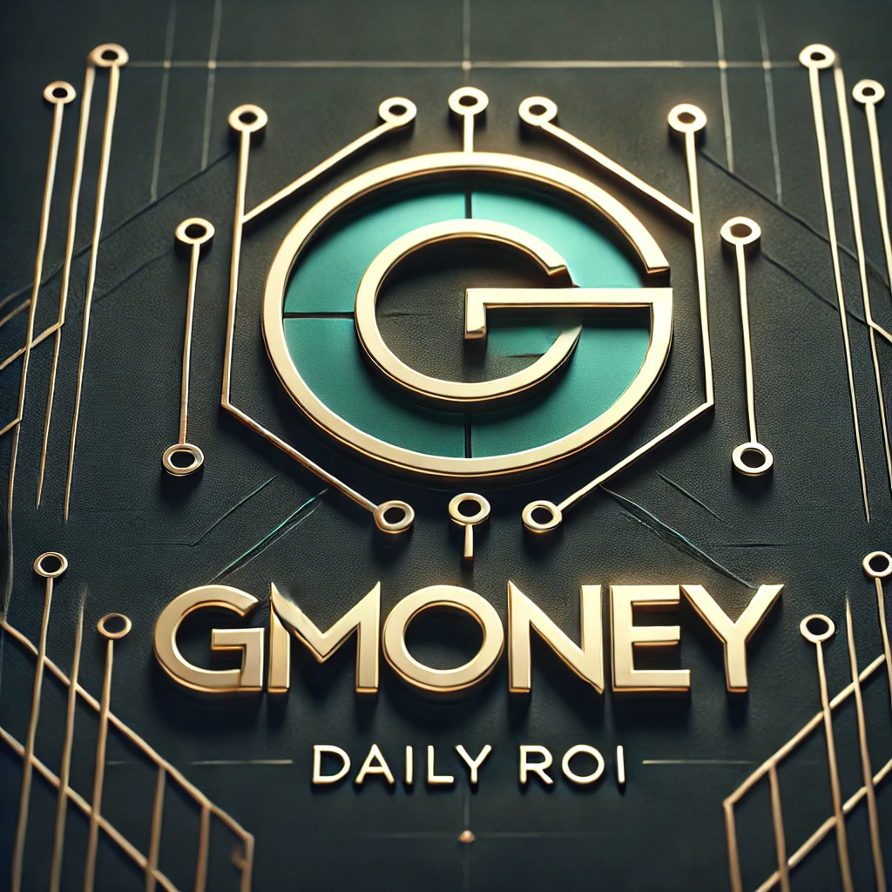

  
  <h1>Whitepaper</h1>

---

## Motivations

---

- Current daily ROI dApps fail to deliver long term appreciation and investor confidence
- Existing products do not use the latest in blockchain technology
- We have years of experience as investors and builders
- Stable coins are booming in volume and trust
- Right place, right time, we know what works and what does not

Daily ROI dApps are highly attractive to DeFi users but often fail due to poor economic design, unsustainable reward structures, and lack of external revenue sources. Similarly, they suffer from "get in early" crypto culture and lack mechanics that promote long term participation and loyalty. They often:

- pay rewards with inflation
- lack external revenue sources
- lack protocol owned liquidity
- lack a treasury reserve and long term mechanics

There are of course things that work well, and why so many have attempted to build one. The following describes a proposal for such a dApp, where compounding daily earnings can excite users for years.

---

## Abstract

---

GMONEY protocol is an innovative staking and yield generating dApp built on the Sonic blockchain, utilizing a two-token system to balance long-term sustainability, external liquidity revenue, and user incentives.

At its core, the protocol allows users to stake and earn USDC as daily, compounding rewards, keeping everything we know and love about daily ROI dApps, but ditching the inflation. Leveraging Protocol-Owned Liquidity (POL) and a deflationary reward token ($GMONEY), the protocol strikes a balance between long term sustainability and user excitement.

The protocol is designed to prevent hyperinflation and maximize capital efficiency, through both automated liquidity management and external revenue from LP fees, reward tokens, and gas tokens. Additional mechanics such as automated burns combat inflation and promote long term appreciation and game theory.

---

## 1. Core Mechanics

- Staking Contract (USDC)
- Token Contract (GMONEY)
- Treasury Contract (USDC)
- Protocol-Owned Liquidity (POL)
- External Revenue Sources

---

### 1.1 Staking Contract

- Users stake **$USDC**, which is permanently locked in the protocol
- Staked USDC is added to the protocol's LP
- Users earn **1%** daily in **$USDC**, withdrawable or compoundable
- When a user claims rewards, their staked amount is reduced by an equivalent amount
- Users who hold **$GMONEY** receive increased yields based on the following table:

| % of Deposited Value | Daily ROI   |
| -------------------- | ----------- |
| 0%                   | 1.00%       |
| 25%                  | 1.25%       |
| 50%                  | 1.50%       |
| 75%                  | 1.75%       |
| 100%                 | 2.00% (Max) |

---

### 1.2 Minting GMONEY

- When a user stakes USDC in the staking contract, GMONEY is minted dynamically based on its current TWAP price
- The minted GMONEY and staked USDC is added to the protocol’s POL, ensuring deep liquidity and supporting trading activity

---

### 1.3 Treasury Contract

- 100% of the presale USDC funds go directly to the treasury to seed initial payouts
- Ongoing USDC earnings from POL fees continuously replenish the treasury
- If the treasury balance runs low, GMONEY is minted and sold into POL to generate necessary USDC

---

### 1.4 Protocol-Owned Liquidity (POL)

- Initial liquidity is provided only in GMONEY, USDC enters over time as users trade
- Managed by SwapX’s YieldIQ vault, optimizing concentrated liquidity in the GMONEY/USDC pool with compounding fees
- The YieldIQ vault autonomously rebalances liquidity, ensuring price stability and maximizing fee capture and protocol support

---

### 1.5 External Revenue Generation

The protocol earns external revenue from a variety of sources. This revenue is used to fund the protocol’s operations and promote sustainability, whether feeding the treasury with USDC, burning GMONEY, or using SwapX and gas rewards

#### 💸 Fee Utilization

- Trading fees from the POL are collected in both USDC & GMONEY
- GMONEY trading fees are burned, while USDC fees are sent to the treasury to fund daily yield payouts
- This dual mechanism ensures deflationary pressure on GMONEY while supporting long-term payouts in a stablecoin

#### 💰 SwapX Rewards

- The protocol earns SwapX tokens as a reward for providing liquidity
- Rewards are then staked to earn yield, which acts as a backup reserve to the treasury

#### 💨 Gas Utilization

- The protocol generates significant transaction gas volume through various operations, including staking, trading, and user's manual liquidity management.
- 90% of the transaction gas volume generated by the protocol is funneled back into buying and burning GMONEY
- This mechanism ensures that the majority of the gas fees are reinvested into the protocol, supporting its sustainability and growth

---

## Presale

- 100K GMONEY tokens sold in the presale for 1 $USDC each
- 100K USDC is sent to the treasury
- 100K GMONEY is added to the POL
- 200K GMONEY intial supply
